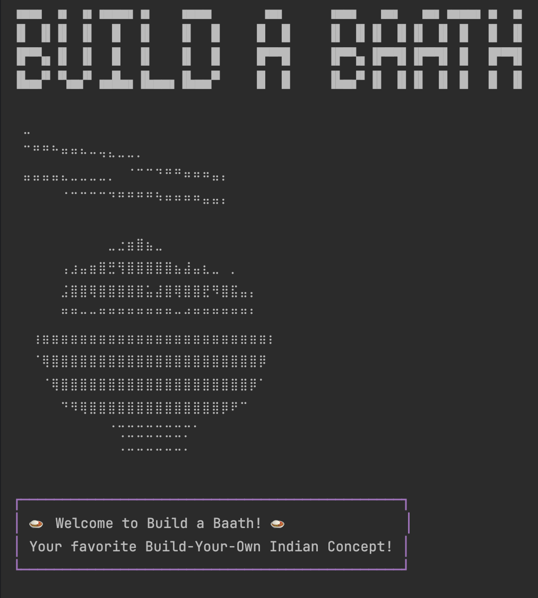
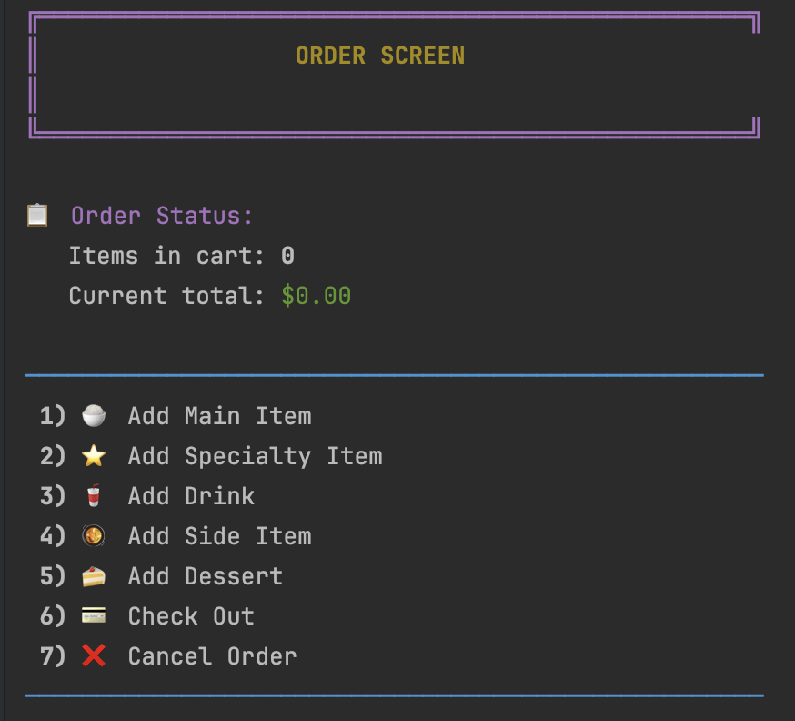
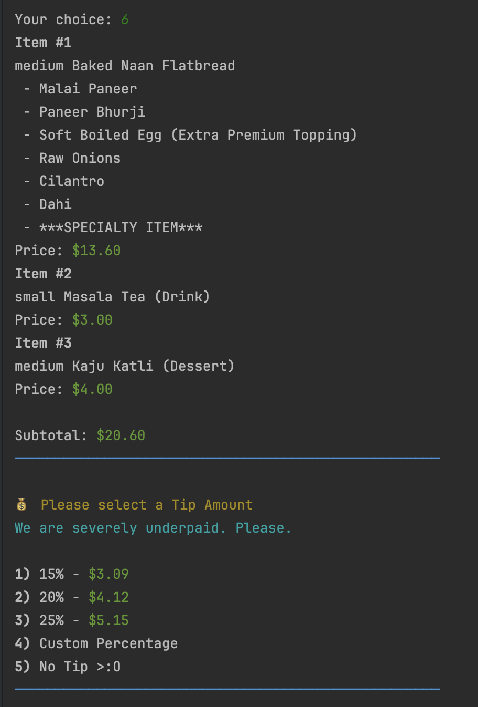

# Build A Baath! 🍲
## Chipotle who??
### What is Baath? 


Baath is something that has been eating since the beginning of time, most commonly known as rice. In the most luscious and bountiful corner of the world, we lovingly call this staple, Baath. 

## Welcome to Build A Baath
Here you are able to build your own special type of bowl, naan flatbread, samosa chaat, or Biryani, load it up with as many proteins, regular and premium toppings, and sauces as you'd like, and even get a chance to take your own handmade clay-pot home. 

Not to mention we also make everything in-house from recipes that have been passed down for countless generations. We also cook all of our items with the exceedingly elusive ingredients, love and passion. 
### Build A Baath features:
- An extensive menu with endless combinations
  - 4 different main types
    - 6 proteins
    - 4 premium toppings
    - 9 regular toppings
    - and 6 sauces
  - 2 rotating *chef curated* specialty items
    - with the ability to customize further
  - 4 tasty and refreshing drinks
  - 2 types of Fresh Tikka Samosas
  - 4 delectable and unforgettable desserts
- An easy way to check out
- Digital receipts that will never be lost

### The Ordering Screen

Here at B.A.B, we know your time is valuable. Which is why we decided to make our ordering process as easy as possible. 

Once you've grabbed all the items your heart and stomach desire, you can select to Check Out, which will give you a concise, but detailed summary of all items, gift you the chance to leave a generous tip and allow you to be on your way. 


## Sneak Peek behind the scenes
Curious to see how it all works? 

B.A.B's top of the line point of sales system is built using Object-Oriented Programming, utilizing features such parent-to-child inheritance, abstract classes, and advanced file writing. 

***Noteworthy Code:***
-
- ### Customize your own specialty items
``` java 
private void customizeSpecialtyItem(SpecialtyItem item) {
        boolean customizing = true;

        customizingLoop: while (customizing) {
            ConsoleFormatter.clearScreen();
            ConsoleFormatter.printHeader("CUSTOMIZE SPECIALTY ITEM");
            System.out.println();

            System.out.printf("%sCurrent Configuration:%s\n",
                    ConsoleFormatter.YELLOW, ConsoleFormatter.RESET);
            System.out.println(item.getDescription());
            System.out.println();

            ConsoleFormatter.printDivider();
            ConsoleFormatter.printMenuItem(1, "🍗 Modify Protein");
            ConsoleFormatter.printMenuItem(2, "⭐ Add/Remove Premium Toppings");
            ConsoleFormatter.printMenuItem(3, "🥗 Add/Remove Regular Toppings");
            ConsoleFormatter.printMenuItem(4, "🍛 Add/Remove Sauces");
            ConsoleFormatter.printMenuItem(0, "✓ Done Customizing");
            ConsoleFormatter.printDivider();

            System.out.print("\nYour choice: ");
            int specialtyChoice = scanner.nextInt();
            scanner.nextLine();

            switch (specialtyChoice) {
                case 1 -> {
                    modifySpecialtyProtein(item);
                }
                case 2 -> {
                    modifyPremiumTopping(item);
                }
                case 3 -> {
                    modifyRegularToppings(item);
                }
                case 4 -> {
                    modifySauces(item);
                }
                case 0 -> {
                    break customizingLoop;
                }
            }
        }
    }
```
Here we have the functionality to modify our chef-curated Specialty Items. It allows for the user to become a chef in their own right, to be able to decide which toppings stay, leave, or become extra.
Depending on which one the user wishes for, the switch-case statement will take them in the right direction that they need to go!

- ### Leave a Tip
```java
private void checkOutOrder(Order currentOrder) {
        ConsoleFormatter.clearScreen();
        viewOrderSummary(currentOrder);

        System.out.print("\nSubtotal: ");
        ConsoleFormatter.printPrice(currentOrder.getTotalPrice());
        System.out.println();
        ConsoleFormatter.printDivider();

        System.out.printf("\n%s💰 Please select a Tip Amount%s\n", ConsoleFormatter.YELLOW, ConsoleFormatter.RESET);
        System.out.printf("%sWe are severely underpaid. Please.%s\n", ConsoleFormatter.CYAN, ConsoleFormatter.RESET);
        System.out.println();

        System.out.printf("%s1)%s 15%% - ", ConsoleFormatter.BOLD, ConsoleFormatter.RESET);
        ConsoleFormatter.printPrice(currentOrder.getTotalPrice() * 0.15);
        System.out.println();

        System.out.printf("%s2)%s 20%% - ", ConsoleFormatter.BOLD, ConsoleFormatter.RESET);
        ConsoleFormatter.printPrice(currentOrder.getTotalPrice() * 0.20);
        System.out.println();

        System.out.printf("%s3)%s 25%% - ", ConsoleFormatter.BOLD, ConsoleFormatter.RESET);
        ConsoleFormatter.printPrice(currentOrder.getTotalPrice() * 0.25);
        System.out.println();

        System.out.printf("%s4)%s Custom Percentage \n", ConsoleFormatter.BOLD, ConsoleFormatter.RESET);
        System.out.printf("%s5)%s No Tip >:O \n", ConsoleFormatter.BOLD, ConsoleFormatter.RESET);
        ConsoleFormatter.printDivider();

        System.out.print("\nYour choice: ");
        int tipAmountChoice = scanner.nextInt();
        scanner.nextLine();

        switch (tipAmountChoice) {
            case 1 -> {
                currentOrder.setTipAmount(15.00);
            }
            case 2 -> {
                currentOrder.setTipAmount(20.00);
            }
            case 3 -> {
                currentOrder.setTipAmount(25.00);
            }
            case 4 -> {
                System.out.println("Enter Tip Percentage: \n");
                double customTipAmount = scanner.nextDouble();
                scanner.nextLine();
                currentOrder.setTipAmount(customTipAmount);
            }
            case 5 -> {
                currentOrder.setTipAmount(0);
            }
        }
        ConsoleFormatter.clearScreen();
        ConsoleFormatter.printHeader("FINAL ORDER SUMMARY");
        System.out.println();
        viewOrderSummary(currentOrder);

        System.out.print("\nSubtotal: ");
        ConsoleFormatter.printPrice(currentOrder.getTotalPrice());
        System.out.printf("\nTip (%.0f%%): ", currentOrder.getTipPercentage());
        ConsoleFormatter.printPrice(currentOrder.getTipAmount());
        System.out.println();
        ConsoleFormatter.printDivider();
        System.out.printf("%sTOTAL: %s", ConsoleFormatter.BOLD, ConsoleFormatter.RESET);
        ConsoleFormatter.printPrice(currentOrder.getFinalTotal());
        System.out.println("\n");
    }
```
With this very special method, we are able to recreate the god-forsaken tip menu that plagues every single store. The checkOutOrder method will not only allow the customer to get a summary of their order, but will suggest tip amounts based on their order totals. 
Not to mention they also have an option to leave a custom tip, if they are feeling generous. 

# What are you waiting for?
### *Come in today, have an excellent meal, wash it down with a tasty drink, finish it off with a tasty treat, and be a part of  the B.A.B family*